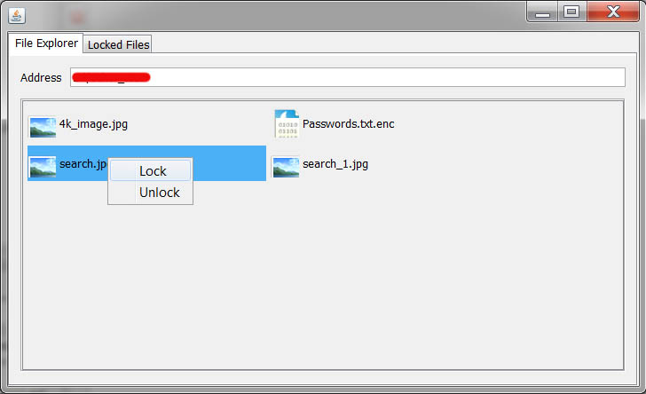

### File Locker

This is a simple java application which locks files by encrypting & decrypting the file content. Files are encrypted with AES256 algorithm with a key that derived from a user entered password. Encrypted files are created in the same directory with `.enc` suffix.

